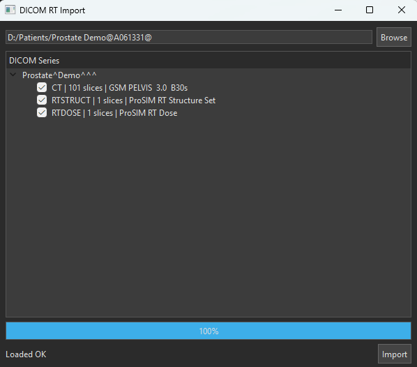
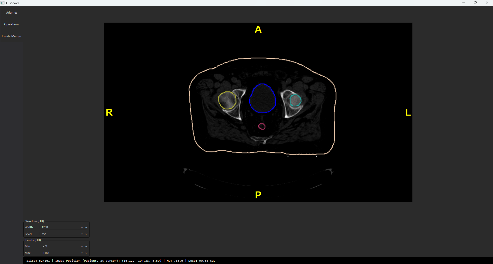
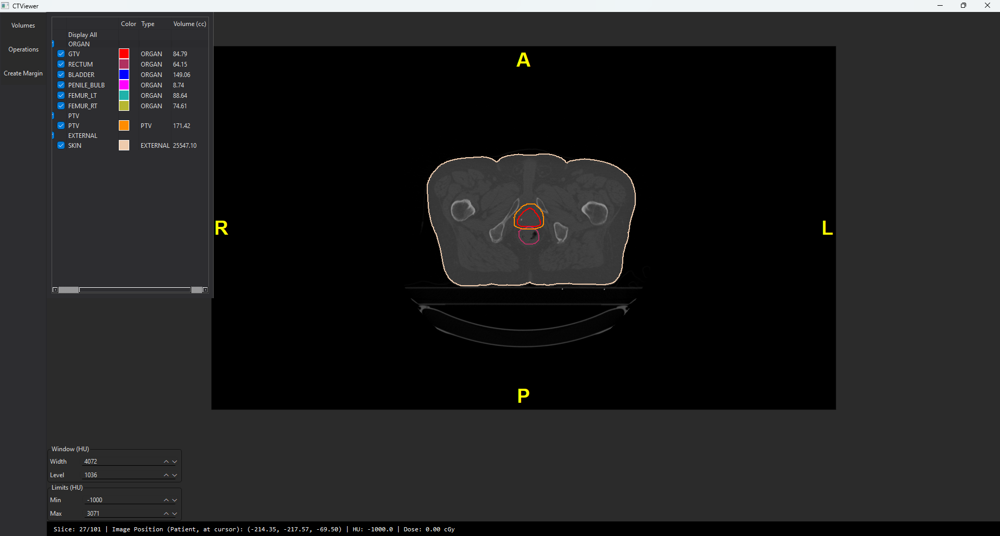

# CTViewer – DICOM CT / RTSTRUCT / RTDOSE Viewer

A lightweight **Treatment Planning System (TPS)** prototype developed in **C++17 / Qt** for learning radiotherapy treatment planning, medical image processing, and dose calculation.

The application supports importing DICOM CT images, RT Structure Sets (RTSTRUCT), RT Dose (RTDOSE), visualizing treatment data, and performing quantitative dose analysis through coordinate transformation and dose interpolation.

---

# Screenshots

## DICOM Import

<p align="center">
    
</p>

Automatically detects CT series, reads DICOM metadata, and constructs a complete 3D CT volume.

---

## CT Viewer

<p align="center">
    
</p>

Interactive CT viewer supporting Window/Level adjustment, zoom, pan, slice navigation, RT Structure overlay and RT Dose visualization.

---

## CT Volume

<p align="center">
    
</p>

Constructed 3D CT volume storing voxel values, spacing, origin, direction matrix and Image Position Patient (IPP).

---

# Features

## CT DICOM Support

### DICOM Import

- Import an entire CT DICOM series
- Automatically detect and sort image slices
- Construct a 3D CT volume
- Read patient and study metadata

### CT Volume

Store

- Hounsfield Unit (HU)
- Voxel spacing
- Image origin
- Direction Cosines
- Image Position Patient (IPP)

---

## CT Viewer

Interactive viewer featuring

- Axial slice visualization
- Mouse wheel slice navigation
- Window / Level adjustment
- Zoom
- Pan
- HU inspection
- Patient information display

---

## RT Structure Support

### RTSTRUCT Import

- Parse RT Structure Set DICOM
- Load all structures

### Structure Processing

- Convert contour points into CT coordinates
- Rasterize contours into binary masks
- Generate 3D mask volumes

### Visualization

- Display contour overlays
- Toggle structure visibility
- Individual colors for each structure

---

## RT Dose Support

### RTDOSE Import

- Import RT Dose DICOM
- Build a 3D Dose Grid

Store

- Dose Grid Scaling
- Dose voxel values
- Grid Frame Offset Vector
- Origin
- Direction Cosines
- Dose spacing

---

## Coordinate Transformation

Implemented a complete coordinate transformation pipeline

```
CT Index
      ↓
Patient Coordinate (mm)
      ↓
Dose Grid Index
```

Supports

- Different image origins
- Different voxel spacing
- Different slice thickness
- Different image orientations

This guarantees accurate registration between CT images and RT Dose regardless of acquisition geometry.

---

## Dose Sampling

Two independent sampling pipelines are implemented.

### Display Sampling

Optimized for interactive rendering.

Features

- Nearest Neighbor interpolation
- Trilinear interpolation
- Cached sampling
- Real-time performance

Used for

- Dose overlay
- Cursor inspection
- Slice rendering

---

### Quantitative Sampling

Designed for dose calculation.

Features

- Pure trilinear interpolation
- No cache
- Optional supersampling
- Higher precision

Used for

- Mean Dose
- Maximum Dose
- Minimum Dose
- Future DVH calculation

---

## Dose Statistics

Implemented

- Mean Dose
- Maximum Dose
- Minimum Dose

Calculation pipeline

```
Mask Volume
      ↓
Coordinate Transformation
      ↓
Dose Sampler
      ↓
Dose Grid
```

---

# System Architecture

```
                   DICOM CT
                       │
                       ▼
                  CT Volume
                       │
                       ▼
          Coordinate Transformation
               │                │
               │                ▼
               │        Display Sampling
               │                │
               │                ▼
               │      Dose Visualization
               │
               ▼
      Quantitative Sampling
               │
               ▼
     Mean / Max / Min Dose
```

---

# Technologies

- C++17
- Qt
- DCMTK
- CMake
- Visual Studio 2022

---

# Project Structure

```
Treatment-Plan-System-TPS
│
├── CTViewerApp/
├── Patients/
├── img/
├── src/
├── CMakeLists.txt
├── CMakePresets.json
└── README.md
```

---

# Build

## Requirements

- Visual Studio 2022
- CMake 3.16+
- Qt 6.x
- DCMTK
- C++17

---

## Clone

```bash
git clone https://github.com/hahuuthai/Treatment-Plan-System-TPS-.git
cd Treatment-Plan-System-TPS-
```

---

## Configure

```bash
mkdir build
cd build

cmake ..
```

---

## Build

```bash
cmake --build . --config Release
```

---

## Run

Executable

```
build/Release/CTViewerApp.exe
```

---

# Usage

### Load CT

```
File
└── Open CT Folder
```

---

### Import RTSTRUCT

```
File
└── Import RTSTRUCT
```

---

### Import RTDOSE

```
File
└── Import RTDOSE
```

---

### Inspect Dose

Move the mouse over the CT image.

The viewer displays

- HU value
- Dose value
- Patient coordinates

---

### Dose Statistics

Select a structure.

The application computes

- Mean Dose
- Maximum Dose
- Minimum Dose

using the Quantitative Sampling pipeline.

---

# Project Status

| Module | Status |
|------------------------------|:------:|
| CT DICOM Import | ✅ |
| CT Volume Construction | ✅ |
| CT Viewer | ✅ |
| Window / Level | ✅ |
| RTSTRUCT Import | ✅ |
| Contour Rasterization | ✅ |
| 3D Mask Volume | ✅ |
| RTDOSE Import | ✅ |
| Coordinate Transformation | ✅ |
| Dose Sampling | ✅ |
| Mean Dose | ✅ |
| Maximum Dose | ✅ |
| Minimum Dose | ✅ |
| Dose Overlay | 🚧 Improving |
| DVH | ⏳ Planned |
| RTPLAN Support | ⏳ Planned |
| 3D Volume Rendering | ⏳ Planned |

---

# Future Work

- Dose Color Wash Overlay
- DVH (Dose Volume Histogram)
- Dose Profile
- Isodose Line Visualization
- RTPLAN Support
- Multi-plan Comparison
- 3D Volume Rendering
- GPU acceleration

---

# Author

Developed as a personal project for studying

- Treatment Planning Systems (TPS)
- DICOM RT standards
- Medical image processing
- Coordinate transformation
- Dose interpolation
- Radiotherapy dose analysis
